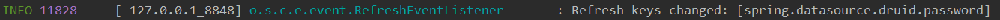
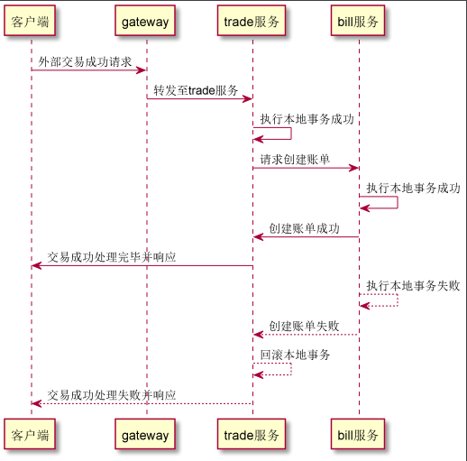
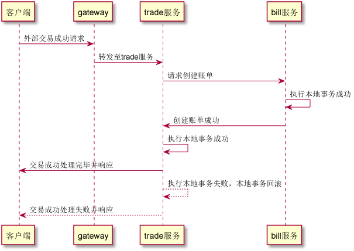

# spring cloud alibaba learning
以支付场景为例，模拟全套微服务解决方案在此场景下的使用

## 代码结构
* ebpp-common 公共包，用于存储URI、常量、工具等
* ebpp-gateway 网关服务，使用spring cloud gateway完成统一鉴权、负载均衡等
* ebpp-nacos-server nacos服务，用作服务注册发现、服务管理、服务路由、配置中心等
* ebpp-sentinel-dashboard sentinel控制台服务
* ebpp-**-route 路径路由，用于各服务API接口的定义，携带URI、出入参等，便于其他服务引用，以及解决URI变化造成其他调用者无法获知导致调用失败的问题
* ebpp-service-trade 交易服务
* ebpp-service-bill 账单服务，与支付系统配合模拟强一致性分布式事务，使用seata，基于全局事务管理理论（即两阶段提交）
* ebpp-service-msg  消息服务，与支付系统配合模拟最终一致性分布式事务，使用消息中间件，基于可靠消息、最大努力通知理论

## 版本
| Module | Version |
| ------ |------|
| Spring Cloud Alibaba | 2.2.6.RC1 |
| Nacos | 1.4.2 |
| Sentinel | 1.8.1 |
| Seata | 1.3.0 |
| RocketMQ | 4.4.0 |
| Spring Boot | 2.3.2.RELEASE |
| Spring Cloud | Spring Cloud Hoxton.SR9 |

## 细节
### Nacos
#### 名词概念的理解
1. 命名空间

用于进行租户粒度的配置隔离。不同的命名空间下，可以存在相同的Group或DataID的配置。Namespace的常用场景之一是不同环境的配置的区分隔离，例如开发测试环境和生产环境的资源（如配置、服务）隔离等（摘自官方）。

2. 服务分组

不同的服务可以归类到同一分组。本人理解的是，可以用来定义同多种服务同属于一个项目集的标识。

3. 配置集

一组相关或者不相关的配置项的集合称为配置集。在系统中，一个配置文件通常就是一个配置集，包含了系统各个方面的配置。例如，一个配置集可能包含了数据源、线程池、日志级别等配置项（摘自官方）。

4. 配置集ID

Nacos中的某个配置集的ID。配置集ID是组织划分配置的维度之一。Data ID通常用于组织划分系统的配置集。一个系统或者应用可以包含多个配置集，每个配置集都可以被一个有意义的名称标识。Data ID通常采用类Java包（如 com.taobao.tc.refund.log.level）的命名规则保证全局唯一性。此命名规则非强制（摘自官方）。

#### 配置中心

1. 在日常编码工作中，怎样的配置架构更合理

* 关于多环境配置（以dev、test、prod三种环境为例）：

dev环境下，我们的目的是更直观、更方便的读写配置文件；test和prod环境下，出于安全运维的考虑，一部分重要的或者全部的应用配置一般都会由配置中心统一管理

* 关于配置文件的加载优先级：

一般的情况下（指没有进行特殊指定时），bootstrap优先于application，properties优先于yml，resources/config优先于resources/

* 关于配置的实时更新：

目前，以我的认知，更倾向于**大部分配置启动时加载，小部分配置实时更新**的策略。

* 关于同环境下配置文件的拆分：

我的观点是尽量少拆分甚至不拆分。原因是现在很难会出现所谓的一个应用（也可以理解为一个jar）由多个团队（或者许多许多人）开发维护的情形，所以就很少有相同环境下存在很多个配置文件（配置集）的情况。
由于很少出现，如果继续将原来1~2个配置文件拆分成若干个分工明确的小型配置文件，反而会增大平时的开发维护成本，增大编码的复杂度。同样的，如果不需要特别细分的配置权限管理，依然去拆分成许多个小的子集，其实也是相对不合理的。

那么有人会质疑，之所以做拆分，是因为要实现修改中心配置时，应用的运行时环境也可以实时地动态更新，拆分的话，会减轻应用更新配置时的资源消耗。

其实，以基于Nacos的动态更新为例，假如我们在Nacos端修改了某一个key的配置，对应的微服务应用其实只会更新这一条配置，以及依赖它的某几个Bean（如果需要）。配置的更新并非是文件维度的，而是key维度，所以谈资源消耗就没什么必要了。下图可以简单看出其中的端倪。



综上观点，本项目采用的配置架构如下：


bootstrap.properties文件负责多环境、应用的基础信息、默认启动端口等配置。例如：
```properties
server.port=9901
spring.profiles.active=dev
spring.application.name=ebpp-service-trade
```
bootstrap-dev.properties文件负责日常开发环境的所有配置，注意是在本地，并非远程配置中心。

bootstrap-prod.properties文件负责设置生产环境的远程配置中心，生产的所有配置在远端（test环境同理）。例如：
```properties
spring.cloud.nacos.config.server-addr=127.0.0.1:8848
spring.cloud.nacos.config.file-extension=properties
spring.cloud.nacos.config.group=DEFAULT_GROUP
```

2. Nacos配置中的DataId如何与某个微服务应用关联起来

在Nacos Spring Cloud中，DataId的完整格式如下：
```
${prefix}-${spring.profiles.active}.${file-extension}
```
prefix默认为spring.application.name的值，也可以通过配置项spring.cloud.nacos.config.prefix来配置。

spring.profiles.active即为当前环境对应的profile。注意：当spring.profiles.active为空时，对应的连接符 **-** 也将不存在，DataId的拼接格式变成${prefix}.${file-extension}

file-exetension为配置内容的数据格式，可以通过配置项spring.cloud.nacos.config.file-extension来配置。目前只支持properties和yaml类型。

以上一个问题中的配置为例，Nacos端生产环境的DataId应该是ebpp-service-trade-prod.properties（.properties必须要有）

### Sentinel

#### 一些思考
1. Feign Client在开启Sentinel支持后，是怎样做到在消费侧处理服务提供者返回的Sentinel异常的

首先，如果服务提供方是被Spring托管的话，一般都会有全局异常捕获处理逻辑，如果提供方绑定的Sentinel规则被触发，继而抛出的BlockException异常为什么不会被全局异常机制捕获呢？
这里，我认为Sentinel的执行机制是容器级别（如Tomcat）的，大概就是说Sentinel是在容器层工作，应该是Filter逻辑，高于Spring，当请求到达服务并触发Sentinel的限流等机制，请求会在触达Spring之前就被拦截掉，所以对应的BlockException也不会被Spring中设置的异常规则所捕获。
关于具体实现，可以通过后续读源码再细究。

2. Sentinel的数据持久化方案及具体实现

Sentinel官方为我们提供了多种数据持久化方案，我们这里采用官方推荐的Nacos Config push方案。
目前，通过直接使用官方提供给我们的starter依赖，并做简单配置，再手动在Nacos端发布对应的配置集，我们可以很方便的完成从远程同步Sentinel配置的工作。
但是，手动配置很难在生产场景大规模应用，我们需要更加高效的方式完成配置集的初始化和动态更新。

3. Sentinel官方提供了基于SPI的Datasource自动注册工具类InitFunc，其应用场景是什么

根据[官方说明](https://sentinelguard.io/zh-cn/docs/dynamic-rule-configuration.html) ，我们做了以下实验（源代码已被删除）。

在com.higlowx.scal.ebpp.service.bill.config.spi包下创建自定义的SPI实现类。
   
```java
package com.higlowx.scal.ebpp.service.bill.config.spi;

import com.alibaba.csp.sentinel.datasource.Converter;
import com.alibaba.csp.sentinel.datasource.ReadableDataSource;
import com.alibaba.csp.sentinel.datasource.nacos.NacosDataSource;
import com.alibaba.csp.sentinel.init.InitFunc;
import com.alibaba.csp.sentinel.slots.block.RuleConstant;
import com.alibaba.csp.sentinel.slots.block.flow.FlowRule;
import com.alibaba.csp.sentinel.slots.block.flow.FlowRuleManager;
import com.alibaba.fastjson.JSON;
import com.alibaba.fastjson.JSONObject;
import com.alibaba.fastjson.TypeReference;
import java.util.ArrayList;
import java.util.List;

public class SentinelDataSourceInitFunc implements InitFunc {

    //尝试使用国际化资源读取，获取配置文件中的属性值，出现报错，SentinelDataSourceInitFunc无法被实例化
    //public static final ResourceBundle R = ResourceBundle.getBundle("application.properties", Locale.CHINA);
    //private static final String SERVER_ADDR = R.getString("spring.cloud.sentinel.datasource.flow.nacos.server-addr");
    //private static final String GROUP_ID = R.getString("spring.cloud.sentinel.datasource.flow.nacos.group-id");
    //private static final String DATA_ID = R.getString("spring.cloud.sentinel.datasource.flow.nacos.data-id");

    private static final String SERVER_ADDR = "localhost:8488";
    private static final String GROUP_ID = "DEFAULT_GROUP";
    private static final String DATA_ID = "com.higlowx.scal.ebpp.service.bill.sentinel.flow";
    
    @Override
    public void init() throws Exception {
        
        //误以为该init方法的作用是，根据每台部署机器的特性组装各种限流降级规则，然后向Nacos传输配置，
        //以免去初次生产部署应用，都要先在Nacos发布配置集，然后再启动应用的问题，现在想来有些误入歧途了，而且有报错。
        
        //误入歧途 开始
        
        //以下暂时仅对flow类型（流量控制）的init进行演示
        //List<FlowRule> flowRules = new ArrayList<>();
        //FlowRule flowRule = new FlowRule();
        //理论上resource的配置可以采用扫描出资源，并进行规模化或特例化配置
        //flowRule.setResource("/bill/main/create");
        //flowRule.setGrade(RuleConstant.FLOW_GRADE_QPS);
        //count值理论上可以根据每台机器的特性计算得出，这样更加合理
        //flowRule.setCount(5);
        //flowRule.setStrategy(RuleConstant.STRATEGY_DIRECT);
        //flowRule.setLimitApp(RuleConstant.LIMIT_APP_DEFAULT);
        //flowRule.setControlBehavior(RuleConstant.CONTROL_BEHAVIOR_DEFAULT);
        //flowRule.setClusterMode(false);
        //flowRules.add(flowRule);
        
        //JSONObject source = new JSONObject();
        //source.put("flow", flowRules);

        //ReadableDataSource<String, List<FlowRule>> flowRuleDataSource;
        //flowRuleDataSource = new NacosDataSource<List<FlowRule>>(SERVER_ADDR, GROUP_ID, DATA_ID,
        //        source.getObject("flow", new TypeReference<List<FlowRule>>() {})
        //);
        
        //误入歧途结束

        ReadableDataSource<String, List<FlowRule>> flowRuleDataSource = new NacosDataSource<List<FlowRule>>(SERVER_ADDR, GROUP_ID, DATA_ID,
                new Converter<String, List<FlowRule>>() {
                    @Override
                    public List<FlowRule> convert(String source) {
                        return JSON.parseObject(source, new TypeReference<List<FlowRule>>() {
                        });
                    }
                });

        FlowRuleManager.register2Property(flowRuleDataSource.getProperty());
    }
}
```
然后在resources目录下创建META-INF/services目录，并在该目录中新建com.alibaba.csp.sentinel.init.InitFunc文件，文件内容如下：
```
com.higlowx.scal.ebpp.service.bill.config.spi.SentinelDataSourceInitFunc
```

运行后得到的结论：

官方提供的该方法只可以做到应用从Nacos端获取Sentinel配置，且内部会监听Nacos push过来的配置更新，后续会自动刷到本实例内存中。

如果我们想要实现Nacos配置集的更新，且不是通过最原始的手动配置方式，官方也给出了一些简易示例：

```java
/*
 * Copyright 1999-2018 Alibaba Group Holding Ltd.
 *
 * Licensed under the Apache License, Version 2.0 (the "License");
 * you may not use this file except in compliance with the License.
 * You may obtain a copy of the License at
 *
 *      http://www.apache.org/licenses/LICENSE-2.0
 *
 * Unless required by applicable law or agreed to in writing, software
 * distributed under the License is distributed on an "AS IS" BASIS,
 * WITHOUT WARRANTIES OR CONDITIONS OF ANY KIND, either express or implied.
 * See the License for the specific language governing permissions and
 * limitations under the License.
 */
package com.alibaba.csp.sentinel.demo.datasource.nacos;

import com.alibaba.nacos.api.NacosFactory;
import com.alibaba.nacos.api.config.ConfigService;

/**
 * Nacos config sender for demo.
 *
 * @author Eric Zhao
 */
public class NacosConfigSender {

    public static void main(String[] args) throws Exception {
        final String remoteAddress = "localhost:8848";
        final String groupId = "Sentinel_Demo";
        final String dataId = "com.alibaba.csp.sentinel.demo.flow.rule";
        final String rule = "[\n"
            + "  {\n"
            + "    \"resource\": \"TestResource\",\n"
            + "    \"controlBehavior\": 0,\n"
            + "    \"count\": 5.0,\n"
            + "    \"grade\": 1,\n"
            + "    \"limitApp\": \"default\",\n"
            + "    \"strategy\": 0\n"
            + "  }\n"
            + "]";
        ConfigService configService = NacosFactory.createConfigService(remoteAddress);
        System.out.println(configService.publishConfig(dataId, groupId, rule));
    }
}
```

### Seata

#### 一些思考

1. 在具体业务中，服务的调用顺序对分布式事务的影响

顺序A：



如果trade服务本地所有的业务逻辑以及事务全部执行成功之后，再调用bill服务去创建账单，注意这个调用处理是同步的。如果bill服务在创建账单的时候因为异常导致执行失败，在有本地事务保障的情况下，bill服务本身最终不会产生脏数据。同步响应回trade服务后，trade服务也会迅速感知到创建账单失败，然后立刻回滚本地的事务。最终整个过程被失败。
我们会发现刚才的流程中，如果不出现其他问题的话，是不需要分布式事务解决方案的。
但是，有的时候，trade服务调用bill服务时可能会出现服务之外的各种问题（网络超时、网络抖动等），这时候trade服务一般会感知到并做出回滚，也是不会产生脏数据的。但是bill服务就不一定了。 一般的，微服务之间还会接入限流、降级和熔断保障，这样调用方会更加快速地对调用其他服务过程中的异常做出反馈，会加剧上述问题的产生，这时候就需要选用适当的分布式事务解决方案来尽量避免这种情况。

顺序B：



如果trade服务在执行完本地所有的事务性逻辑之前，调用了bill服务去创建账单，假设bill服务的处理和响应是成功且快速的。后续，trade服务内部再出现了异常，导致本地事务回滚了，那bill服务呢，如何回滚（或者删除刚才创建的账单）？单独再去调用删除脏数据的API对于实际生产来说是并不方便的（不论是同步还是异步的）。
这种情况也是十分典型的分布式事务问题。


   
   
   